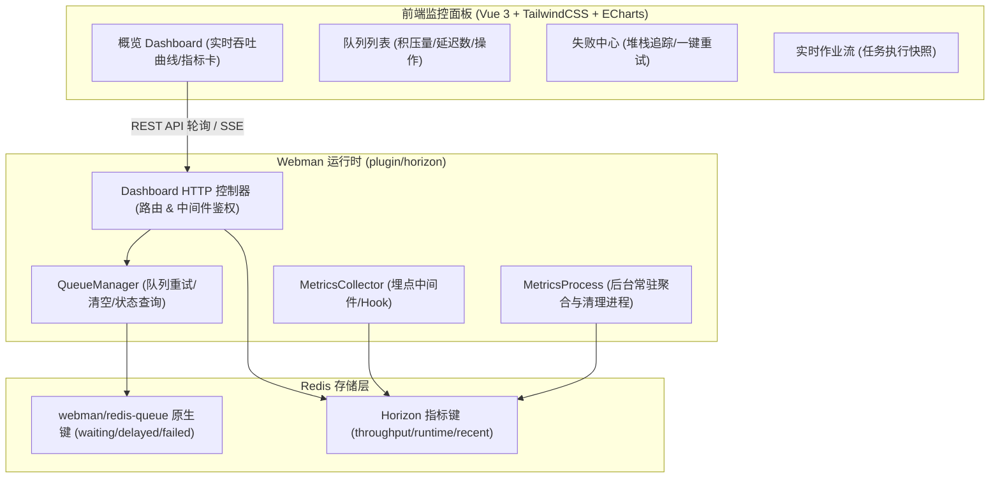

# Webman Horizon (Redis 队列监控面板) 完整架构设计与实现方案

## 1. 项目定位与目标 (Goal Description)

本项目为 **Webman** 生态的 `webman/redis-queue` 打造类似 **Laravel Horizon** 的高性能、开箱即用的可视化队列监控面板与指标统计系统。

严格遵循 [Webman 官方应用插件（App Plugin）开发规范](https://www.workerman.net/doc/webman/app/app.html)，具备以下核心能力：
1. **零配置开箱即用**：安装插件后，访问 `/app/horizon` 即可直接进入现代化 UI 面板，支持发布到官方应用市场。
2. **实时指标监控**：监控队列等待数（Waiting）、延迟数（Delayed）、失败数（Failed）、分钟级吞吐量走势（Throughput）与作业运行时长（Runtime）。
3. **失败作业中心**：支持查看失败作业详情、完整异常堆栈调用、单条重试、批量重试与一键清空。
4. **现代化高颜值 UI**：基于 Vue 3 + TailwindCSS + ECharts 构建，暗黑质感与 Horizon 官方体验对齐，且预编译为纯静态资源直接随包发布，使用者无需 Node.js 环境。

---

## 2. 规范与架构设计 (App Plugin Specification)

### 2.1 规范要素
* **应用插件标识**：`horizon`
* **应用根目录**：`plugin/horizon/`
* **命名空间**：`plugin\horizon\`
* **访问路由前缀**：`/app/horizon`（同时支持自定义路由别名如 `/horizon`）
* **静态资源映射**：`plugin/horizon/public/` 自动映射为静态 Web 访问

### 2.2 系统架构拓扑图



---

## 3. 标准目录结构与代码组织

在仓库中组织为标准的 Webman 应用插件目录结构：

```text
D:\dnmp\www\ai\webman-horizon\
├── api/
│   └── Install.php                  # Webman 官方应用市场安装/卸载脚本
├── app/
│   ├── controller/
│   │   ├── IndexController.php      # 前端 SPA 入口渲染
│   │   ├── StatsController.php      # 仪表盘整体统计与吞吐指标 API
│   │   ├── QueueController.php      # 队列列表与管理 API
│   │   └── FailedJobController.php  # 失败任务管理与重试 API
│   ├── middleware/
│   │   └── AuthMiddleware.php       # 监控面板鉴权中间件 (Basic Auth / 白名单)
│   ├── process/
│   │   └── MetricsProcess.php       # 常驻内存后台指标采样与清理进程
│   ├── service/
│   │   ├── QueueManager.php         # 队列核心操作与状态服务
│   │   └── MetricsCollector.php     # 吞吐量与耗时采样指标采集器
│   └── functions.php
├── config/
│   ├── app.php                      # 插件开关、基本信息配置
│   ├── route.php                    # 独立路由配置
│   ├── middleware.php               # 插件全局中间件
│   └── process.php                  # 自定义进程配置 (拉起 MetricsProcess)
├── public/                          # Vue 3 预编译静态产物（HTML / CSS / JS，免构建开箱即用）
│   ├── index.html
│   ├── css/
│   └── js/
├── resources/                       # 对标 Horizon 官方前端源码工程
│   ├── css/                         # Tailwind 全局样式与主题
│   │   └── app.css
│   ├── js/                          # Vue 3 前端源码
│   │   ├── components/              # 通用组件
│   │   ├── screens/                 # 6 大核心屏 (dashboard, monitoring, metrics, recentJobs, failedJobs, batches)
│   │   ├── App.vue                  # 顶层 App 组件
│   │   ├── app.js                   # 入口文件
│   │   └── routes.js                # Vue Router 路由定义
│   └── index.html                   # Vite 模板
├── package.json                     # 前端依赖配置
├── vite.config.js                   # Vite 构建配置
├── tailwind.config.js               # TailwindCSS 配置
├── postcss.config.js                # PostCSS 配置
├── composer.json                    # Composer 插件定义
└── README.md
```

---

## 4. 核心功能与模块实现细节

### 4.1 数据结构映射设计
对齐 `webman/redis-queue` 底层 Redis 结构：
* 等待队列：`redis-queue-waiting:{queue}` (List)
* 延迟队列：`redis-queue-delayed:{queue}` (Zset，Score 为时间戳)
* 失败队列：`redis-queue-failed:{queue}` (List，存 json payload)

Horizon 监控扩展层结构：
* 分钟级吞吐计数：`horizon:metrics:throughput:{queue}:{YmdHi}` (String / INCR，保留48小时)
* 分钟级执行耗时：`horizon:metrics:runtime:{queue}:{YmdHi}` (List，保留48小时)
* 失败任务扩展详情：`horizon:failed_jobs` (Hash)

### 4.2 路由与 API 设计 (`config/route.php`)
```php
use Webman\Route;
use plugin\horizon\app\controller\IndexController;
use plugin\horizon\app\controller\StatsController;
use plugin\horizon\app\controller\QueueController;
use plugin\horizon\app\controller\FailedJobController;

// 控制台页面
Route::get('/app/horizon', [IndexController::class, 'index']);
Route::get('/app/horizon/{path:.+}', [IndexController::class, 'index']); // 支持 SPA 刷新路由

// RESTful 接口
Route::group('/app/horizon/api', function () {
    Route::get('/stats', [StatsController::class, 'index']);
    Route::get('/throughput', [StatsController::class, 'throughput']);
    Route::get('/queues', [QueueController::class, 'index']);
    Route::get('/failed-jobs', [FailedJobController::class, 'index']);
    Route::post('/failed-jobs/retry', [FailedJobController::class, 'retry']);
    Route::post('/failed-jobs/retry-all', [FailedJobController::class, 'retryAll']);
    Route::delete('/failed-jobs', [FailedJobController::class, 'delete']);
})->middleware([
    \plugin\horizon\app\middleware\AuthMiddleware::class
]);
```

### 4.3 自定义指标采样进程 (`app/process/MetricsProcess.php`)
```php
namespace plugin\horizon\app\process;

use Workerman\Timer;
use plugin\horizon\app\service\MetricsCollector;

class MetricsProcess
{
    public function onWorkerStart(): void
    {
        // 每 10 秒定时聚合采样与过期 Key 清理
        Timer::add(10, function () {
            MetricsCollector::cleanupExpiredMetrics();
        });
    }
}
```

### 4.4 前端实现方案
* **框架**：Vue 3 Composition API + Vue Router 4
* **样式**：TailwindCSS（高对比度黑灰深色主题，1:1 对标 Horizon 质感）
* **图表**：Apache ECharts（过去 60 分钟每分钟吞吐量曲线）
* **交付模式**：前端源码在 `resources/` 开发并对齐官方 6 大 Screens，同时提供开箱即用内嵌版 `public/index.html`，最终用户不需要安装 Node.js，即插即用。

---

## 5. 实施路线图 (Implementation Steps)

1. **第一阶段：后端基础设施与核心服务**
   - 编写 `composer.json`（支持 `extra.webman` 插件自动加载）
   - 实现 `QueueManager`（对接 `webman/redis-queue` 队列数据查询、重试、清空）
   - 实现 `MetricsCollector`（吞吐统计、耗时记录、历史数据提取）
   - 编写 `config/` 配置文件（`app.php`, `route.php`, `process.php`）
   - 编写 `api/Install.php`

2. **第二阶段：控制台 API 与守护进程**
   - 实现 `StatsController`、`QueueController`、`FailedJobController`
   - 实现 `AuthMiddleware`（支持账号密码认证与本地访问豁免）
   - 实现 `MetricsProcess` 定时聚合与维护进程

3. **第三阶段：Vue3 + Tailwind 现代化前端构建**
   - 在 `frontend/` 下初始化 Vite + Vue 3 + TailwindCSS + ECharts
   - 构建 Overview、Queues、FailedJobs 界面
   - 打包构建（Build）生成静态产物并输出至 `public/`

4. **第四阶段：集成测试与发布**
   - 在真实 Webman 项目中接入测试
   - 验证队列生产、延迟、消费失败、重试全流程与仪表盘展示
   - 完善使用说明文档与市场发布包
